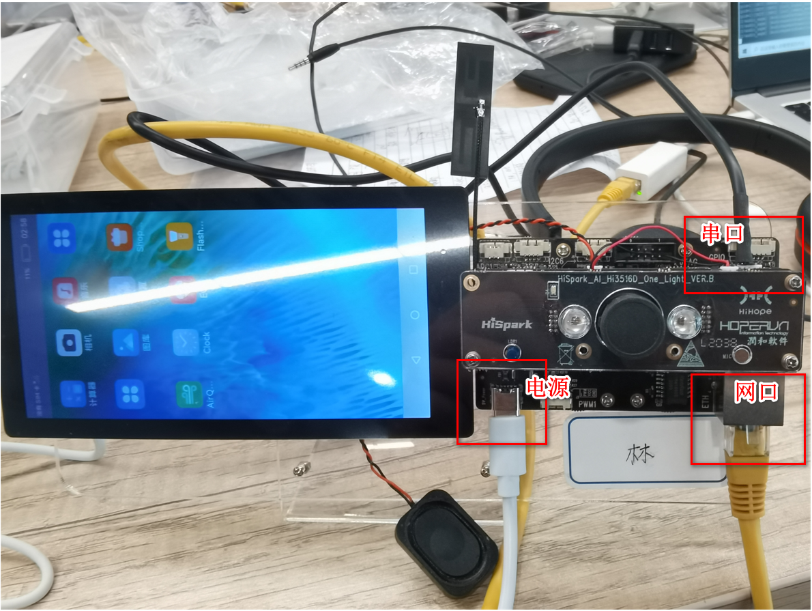
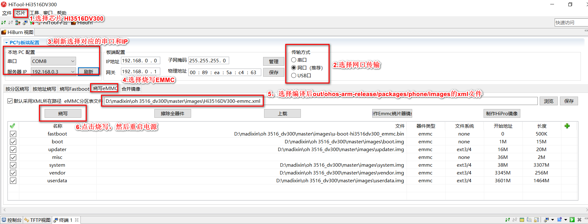

# 目标：在3516 dv300开发板上，运行ArkUI helloworld
使用2021.9.30 openharmony3.0-lt3，编译L2标准系统，并烧录在润和3516 DV300开发板上，运行基于ARKUI的ETS应用

# 详细步骤
## 1. 购买润和3516 dv300开发板

淘宝搜索“润和HramonyOS HiSpark Taurus AI Camera(Hi3516d)开发板套”


## 2.组装3516开发板

参考[视频](https://www.bilibili.com/video/BV175411V7ht)，我家二年级的小朋友看了都会组装。。。


## 3.Docker容器编译openHarmony3.0-LTS版本
参考[官网文章](https://gitee.com/openharmony/docs/blob/OpenHarmony-3.0-LTS/zh-cn/device-dev/quick-start/quickstart-standard-docker-environment.md)
1.配置git和安装repo

```
git config --global user.name "yourname"
git config --global user.email "your-email-address"
git config --global credential.helper store

curl -s https://gitee.com/oschina/repo/raw/fork_flow/repo-py3 > /usr/local/bin/repo  #如果没有权限，可下载至其他目录，并将其配置到环境变量中
chmod a+x /usr/local/bin/repo
pip3 install -i https://repo.huaweicloud.com/repository/pypi/simple requests
```

2.安装git-lfs 

```
sudo apt-get install git-lfs
```
3.使用repo下载代码，注意-b选择分支，比如master或OpenHarmony-3.0-LTS

```
repo init -u https://gitee.com/openharmony/manifest.git -b OpenHarmony-3.0-LTS --no-repo-verify
repo sync -c
repo forall -c 'git lfs pull'
sudo bash build/prebuilts_download.sh
```

**PS:**注意“bash build/prebuilts_download.sh”有的时候会因网络的问题没下完，如果没下完的话，请重试，确保预编译的工具都下载完成。

4.docker pull & docker run 进入容器编译，使用-v挂载外部代码

```
docker pull swr.cn-south-1.myhuaweicloud.com/openharmony-docker/openharmony-docker-standard:0.0.4

docker run -it -v $(pwd):/home/openharmony swr.cn-south-1.myhuaweicloud.com/openharmony-docker/openharmony-docker-standard:0.0.4
```

5.通过如下编译脚本启动标准系统类设备（参考内存≥128MB）的编译  ./build.sh --product-name Hi3516DV300

```
./build.sh --product-name Hi3516DV300
```

结果镜像输出在 **out/ohos-arm-release/packages/phone/images/ **目录下

**PS:**我使用的是2U4G的云编译，中间会编译失败，看问题是内存不够导致，解决方案是重新执行上述编译命令，必要时重启下再执行。如果总是编译失败，有可能是前面repo sync , git lfs pull 或者prebuilts_download.sh没有成功执行完导致，请重复执行确认都下载完。


## 4.烧录openHarmony3.0-LTS到3516开发板

这是最复杂的步骤，没有之一。。。

我是参考了[数字管家- 智能电子牌]([https://gitee.com/openharmony-sig/knowledge_demo_smart_home/tree/master/dev/docs/electronic_borad#3-%E5%9B%BA%E4%BB%B6%E7%83%A7%E5%BD%95](https://gitee.com/openharmony-sig/knowledge_demo_smart_home/tree/master/dev/docs/electronic_borad#3-固件烧录)),使用Hitools工具烧录，这个是Hitools的下载[地址](http://www.hihope.org/download/download.aspx?mtt=33)

#### 烧录方式一：网口烧录(烧录时间80-90分钟。。。why?)

1.请连接好电脑和待烧录开发板，需要同时连接串口、网口和电源，具体可参考[Hi3516DV300开发板介绍](https://device.harmonyos.com/cn/docs/start/introduce/oem_minitinier_des_3516-0000001152041033)。



2.打开电脑的设备管理器，查看并记录对应的串口号。

 如果对应的串口异常，请根据[Hi3516DV300/Hi3518EV300开发板串口驱动安装指导](https://device.harmonyos.com/cn/docs/ide/user-guides/hi3516_hi3518-drivers-0000001050743695)安装USB转串口的驱动程序。


3.笔记本关闭wifi，连接网线，找到对应的以太网，设置IP地址，网关


4. 打开HiTool工具，如下图设置后，点击烧写，重启电源

   

开始烧写。。。


5. 第一次烧录3.0镜像后，启动时需要设置，参考官网中给的[命令](https://gitee.com/openharmony/docs/blob/OpenHarmony-3.0-LTS/zh-cn/device-dev/quick-start/quickstart-standard-running.md)设置（仅第一次烧录时需要）。使用方式：在终端1窗口设置正确端口号，如COM8，点击连接。重启开发板电源时，迅速按回车，输入如下命令

   

   ```
   setenv bootargs 'mem=640M console=ttyAMA0,115200 mmz=anonymous,0,0xA8000000,384M clk_ignore_unused rootdelay=10 hardware=Hi3516DV300 init=/init root=/dev/ram0 rw blkdevparts=mmcblk0:1M(boot),15M(kernel),20M(updater),2M(misc),3307M(system),256M(vendor),-(userdata)';
   
   setenv bootcmd 'mmc read 0x0 0x82000000 0x800 0x4800; bootm 0x82000000'
   
   save
   
   reset


#### 烧录方式二：USB烧录(烧录时间4分钟.....网线烧录的时间太令人失望了，不甘心了，换一种姿势)

1.请连接好电脑和待烧录开发板，需要同时连接串口和USB口，具体可参考[Hi3516DV300开发板介绍](https://device.harmonyos.com/cn/docs/start/introduce/oem_minitinier_des_3516-0000001152041033)。


2.打开电脑的设备管理器，查看并记录对应的串口号。

 如果对应的串口异常，请根据[Hi3516DV300/Hi3518EV300开发板串口驱动安装指导](https://device.harmonyos.com/cn/docs/ide/user-guides/hi3516_hi3518-drivers-0000001050743695)安装USB转串口的驱动程序。


3.安装USB驱动，下载[地址](http://www.hihope.org/download/download.aspx?mtt=11)


如果安装驱动后，还提示不识别的USB设备，请将下面的内容保存未一个注册表文件，如test.reg，然后注册。

**PS**不要问我为啥，别人发我的，我就这么做了。。。。

```
Windows Registry Editor Version 5.00

[HKEY_LOCAL_MACHINE\SYSTEM\CurrentControlSet\Control\usbflags\12D1D0010100]
"SkipBOSDescriptorQuery"=hex:01,00,00,00
"osvc"=hex:00,00
"IgnoreHWSerNum"=hex:01
```

5.使用Hitools，烧写，然后按住串口边上的复位键，插拔USB电源线重启


6.烧写成功，看到这时间，是不是欣慰极了。。


7.第一次烧录3.0镜像后，按照上面网口烧录的最后一步，进行镜像运行的设置。


## 5.使用DevEcoStudio 3.0+创建ETS应用工程，编辑和部署到3516板子

1.[HarmonyOS官网](https://developer.harmonyos.com/cn/develop/deveco-studio#download_beta)下载3.0以上的DevEcoStudio

2.安装DevEco Studio,并安装OpenHarmonySDK，没啥好说的，一路点下一步，网上教程一堆。

  值得说明的是，如果烧录的不是LTS的镜像，是自己编出来的镜像，则最好自己编译[openharmonySDK](https://www.jianshu.com/p/f2d72a9e3eaa)，与镜像对应。

3.打开DevEco Studio选择**[Standard]Empty Ability**模板创建OpenHarmony应用。


4.输入工程名，选择Application，输入包名（跟下一步的签名强相关），选择ETS语言，点击创建。


4.点击"Preview"预览工程，可以修改下文字和按钮的标题，颜色，背景，字体大小


5.参考官网链接，完成[签名]([配置OpenHarmony应用签名信息 | OpenHarmony](https://www.openharmony.cn/pages/00090003/#生成密钥和证书请求文件)

6.点击“Build Haps”，在bulid目录下生成signed签名后的hap包
**PS**因为当前3.0.0.601版本，build hap并不能覆盖旧的Hap(已提单给IDE反馈)，所以每次编译需要先清除一下


7.开发板此时只需要使用USB线连接电脑。将OpenHarmony SDK -> toolchains 路径配置为环境变量，然后运行hdc_std install -r path，path为signed.hap的绝对路径 如下图所示即为安装成功。

```
cd /d D:\madixin\openharmonysdk\toolchains

hdc_std.exe list targets

hdc_std install -r   D:\madixin\openharmonyCode\knowledge_demo_smart_home\FA\HelloTest\build\outputs\hap\debug\phone\entry-debug-rich-signed.hap
```


**PS1** hdc_std install使用绝对路径，使用相对路径总是会安装到第一次安装的包，未知原因比较诡异，建议使用绝对路径

**PS2** 安装后提示sign error，注意检查签名信息


## 6.调试方法
目前不知道如何debug，因此只能使用如下方法定位问题：
1.首先推荐使用toast弹框来打印需要的信息prompt.showToast
2.接口报错的情况下使用hdc_std hilog 或者hdc_std hilog >path，path为文本文件路径。 （日志记录使用console.info...）


## 7.多个设备调测分布式

让3516处在分布式网络可使用如下两种方式
1.手机开无密码热点，2台3516连上热点且和手机都放在较近的位置，因为3516wifi接收功率较差，距离热点1米以上容易断开。
2.网线连接两台3516，然后分别3516设置不同IP，每次重启都需要重新配置
3516（1）：hdc_std shell ifconfig eth0 192.168.1.222 netmask 255.255.255.0
3516（2）：hdc_std shell ifconfig eth0 192.168.1.111 netmask 255.255.255.0
