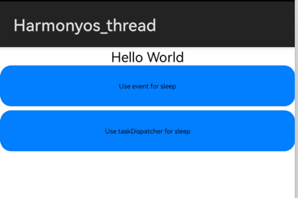
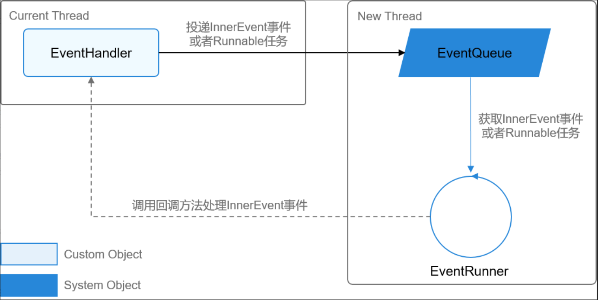
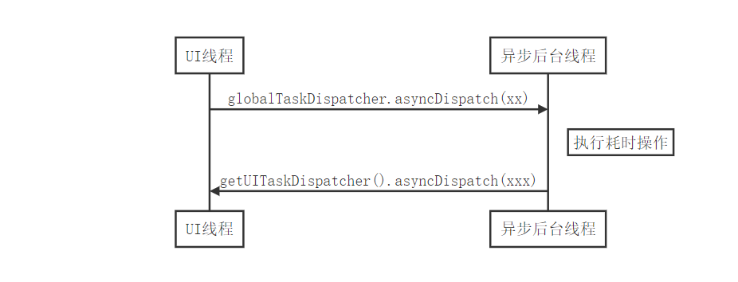

# 1.  Eventhandler,Taskdispacher异步任务
### 内容介绍
在实际项目中，许多耗时的操作如下载文件，调用远程接口，查找设备，或进行复杂计算等，导致了应用界面无响应，带来了非常不好的用户体验，原因是它阻塞了应用的UI线程。

何谓应用的UI线程？每个HarmonyOS应用程序启动时，系统都会为其创建一个主线程，这个线程叫做UI线程。它负责与UI界面的显示和更新等操作，伴随着当前应用的整个生命周期。我们可以做个试验：在ability的生命周期的onStart方法中和按钮按下时响应函数处，分别打印当前线程ID，会发现当前的线程ID都是“1”，它就是UI线程（主线程）。

```java
    @Override
    public void onStart(Intent intent) {
        super.onStart(intent);
        super.setUIContent(ResourceTable.Layout_ability_main);
        HiLog.info(LABEL, "onStart：" + +Thread.currentThread().getId());
    }
```

因此，为不阻塞UI线程，我们需要将这些耗时操作都要放到子线程中，避免阻塞主线程，同时需要把操作的结果数据反馈给UI线程。

当前HarmonyOS java应用开发提供了**EventHandler**和**TaskDispacher**2种方式来实现，下面我们将以一个应用实例来演示如何使用。

### 需要掌握的知识
- 下载和安装DevEco Studio。
- 创建HarmonyOS应用，并使用模拟器或真实设备运行。
- 使用XML中声明UI布局，添加按钮响应事件。
- 使用HiLog输出日志
### 我们将学会
使用**EventHandler**和**TaskDispatcher**异步处理耗时操作，并与主线程相互通信，刷新界面元素。
### 我们将做以下几个步骤
- 创建一个简单的HarmonyOS应用工程。
- 在主界面中添加两个Button，分别使用**EventHandler**和**TaskDispatcher**在非主线程中睡眠5秒，睡眠完成后通知主线程，更新界面Text的文字。
# 2. 最终的应用程序
最终的界面如下图：

点击第一个Button，将使用**EventHandler**睡眠五秒后，更新Text。
点击第二个Button，将使用**TaskDispatcher**睡眠五秒后，更新Text。



# 3.任务1:创建异步任务工程

1.1 创建HarmonyOS应用工程，编辑界面
	1.新建**Harmonyos_thread**工程，选择**Phone**设备和**Empty Feature Ability(java)**模板，其他选项使用默认。
	2.在**entry\src\main\resources\base\graphic**目录下，新增资源文件**background_button.xml**，用于描述Button按钮的样式：形状，圆角和颜色。
**background_button.xml**完整代码如下：

```xml
<?xml version="1.0" encoding="utf-8"?>
<shape xmlns:ohos="http://schemas.huawei.com/res/ohos"
       ohos:shape="rectangle">
    <corners
        ohos:radius="40"/>
    <solid
        ohos:color="#007CFD"/>
</shape>
```

	3.编辑**ability_main.xml**，使用**DirectionalLayout**布局，添加一个Text，和两个Button。

**ability_main.xml**完整代码如下：

```xml
<?xml version="1.0" encoding="utf-8"?>
<DirectionalLayout
    xmlns:ohos="http://schemas.huawei.com/res/ohos"
    ohos:height="match_parent"
    ohos:width="match_parent"
    ohos:orientation="vertical">

    <Text
        ohos:id="$+id:text_helloworld"
        ohos:height="match_content"
        ohos:width="match_content"
        ohos:layout_alignment="horizontal_center"
        ohos:text="$string:HelloWorld"
        ohos:text_size="50"
        />

    <Button
        ohos:id="$+id:btn_handler_sleep"
        ohos:height="50vp"
        ohos:width="match_parent"
        ohos:text="Use event for sleep"
        ohos:background_element="$graphic:background_button"
        />

    <Button
        ohos:id="$+id:btn_dispatcher_sleep"
        ohos:height="50vp"
        ohos:width="match_parent"
        ohos:top_margin="5vp"
        ohos:text="Use taskDispatcher for sleep"
        ohos:background_element="$graphic:background_button"
        />
</DirectionalLayout>
```

# 4.任务2: 使用EventHandler处理异步任务
EventHandler是一种用户在当前线程上投递InnerEvent事件或者Runnable任务到异步线程上处理的机制。每一个EventHandler和指定的EventRunner所创建的新线程绑定，并且该新线程内部有一个事件队列。这里主要演示其托管模式，它不需要开发者调用run()和stop()方法去启动和停止EventRunner。另外一种为手动模式：需要开发者自行调用EventRunner的run()方法和stop()方法来确保线程的启动和停止。其主要机制见下图：
# 
1.  在**MainAbilitySlice**类中定义日志Label和任务ID。其中日志便于我们调试定位和查看当前执行的线程ID是否为主线程，即线程ID为“1”的线程。任务ID用于区分不同的任务号，后续会在**processEvent**中使用到，这里把它抽取为一个常量，便于统一维护。

```java
    // 定义日志标签
    private static final HiLogLabel LABEL = new HiLogLabel(HiLog.LOG_APP, 0x00201, "MainAbilitySlice");
    // 定义任务ID
    private static final int EVENT_MESSAGE_NORMAL = 666;
```
2.  在**MainAbilitySlice**类中定义和获取Button,Text元素，并处理Button的click事件

```java
    private Button eventSleepBtn;
    private Button dispatcherSleepBtn;
    private Text resultText;

    @Override
    public void onStart(Intent intent) {
        super.onStart(intent);
        super.setUIContent(ResourceTable.Layout_ability_main);
        HiLog.info(LABEL, "onStart：" + +Thread.currentThread().getId());
        initView();
    }

    private void initView() {
        if (findComponentById(ResourceTable.Id_text_helloworld) instanceof Text) {
            resultText = (Text) findComponentById(ResourceTable.Id_text_helloworld);
        }
        if (findComponentById(ResourceTable.Id_btn_handler_sleep) instanceof Button) {
            eventSleepBtn = (Button) findComponentById(ResourceTable.Id_btn_handler_sleep);
            eventSleepBtn.setClickedListener(this::takeHandlerSleep);
        }
        if (findComponentById(ResourceTable.Id_btn_dispatcher_sleep) instanceof Button) {
            dispatcherSleepBtn = (Button) findComponentById(ResourceTable.Id_btn_dispatcher_sleep);
            dispatcherSleepBtn.setClickedListener(this::takeDispatcherSleep);
        }
    }
```

3. 在**MainAbilitySlice** 类中创建**MyEventHandler**子类，它继承于**EventHandler**，重写方法**processEvent()**来处理任务。

```java
private class MyEventHandler extends EventHandler {
        private MyEventHandler(EventRunner runner) {
            super(runner);
        }

        // 重写processEvent方法
        @Override
        public void processEvent(InnerEvent event) {
            super.processEvent(event);
            int eventId = event.eventId;
            switch (eventId) {
                case EVENT_MESSAGE_NORMAL:
                    //todo 独立线程处理耗时操作
                    break;
            }
        }
}
```
4.  在UI线程里触发按钮响应，创建托管的EventRunner，投递的优先级为IMMEDIATE的事件。注意：这里通过EventRunner.current()获取当前线程的eventrunner，并把其作为参数传递，用于任务执行完后回调UI线程刷新界面元素Text。注意：InnerEvent的ID,参数均可以自定义，真实场景可按需传递。

```java
private void takeHandlerSleep(Component component) {
    HiLog.info(LABEL, "Hey! You have take a handler sleep:" + Thread.currentThread().getId());

    // 创建和使用非托管的EventRunner
    EventRunner runner = EventRunner.create("handler sleep thread");
    MyEventHandler myHandler = new MyEventHandler(runner);

    param = 0L;
    InnerEvent normalInnerEvent = InnerEvent.get(EVENT_MESSAGE_NORMAL, param, EventRunner.current());
    // 发送一个事件到事件队列，延时为0ms, 优先级为LOW
    myHandler.sendEvent(normalInnerEvent, 0, EventHandler.Priority.IMMEDIATE);
}
```
5.  **processEvent()**中任务处理完后，从参数中获取UI线程的eventrunner，投递回UI线程，刷新界面。

```java
// 将原先线程的EventRunner实例投递给新创建的线程
EventRunner uiEventRunner = (EventRunner) object;
// 将原先线程的EventRunner实例与新创建的线程的EventHandler绑定
EventHandler uiEventHandler = new EventHandler(uiEventRunner) {
            @Override
            public void processEvent(InnerEvent event) {
                //todo UI线程更新界面元素
           }
};   
```
# 5.任务3: 使用Taskdispacher处理异步任务
TaskDispatcher是一个任务分发器，它是Ability分发任务的基本接口，隐藏任务所在线程的实现细节。
TaskDispatcher具有多种实现，每种实现对应不同的任务分发器。在分发任务时可以指定任务的优先级，由同一个任务分发器分发出的任务具有相同的优先级。系统提供的任务分发器有GlobalTaskDispatcher、ParallelTaskDispatcher、SerialTaskDispatcher 、SpecTaskDispatcher。这里我们只涉及单个任务，因此只使用GlobalTaskDispatcher，以及UITaskDispatcher分发任务给UI主线程。

1. 在第二个Button的响应函数里，使用GlobalTaskDispatcher，异步派发异步任务，返回值是一个可用于取消任务的接口。

```java
private void takeDispatcherSleep(Component component) {
  TaskDispatcher globalTaskDispatcher = getGlobalTaskDispatcher(TaskPriority.DEFAULT);

  Revocable revocable = globalTaskDispatcher.asyncDispatch(new Runnable() {
   	  @Override
	  public void run() {
		  //todo 独立线程处理耗时操作
	  }
  });
}

```

2. 异步任务后台线程执行完耗时操作后，使用UITaskDispatcher，派发任务回UI线程刷新界面。

```java
getUITaskDispatcher().syncDispatch(
    () -> {
          //todo UI线程更新界面元素
    }
);
```
# 6.完整项目地址：
[harmonyos-thread](https://codehub-g.huawei.com/HarmonyOS-examples/HarmonyOS-examples/files?ref=master&filePath=examples%2FHarmonyos_thread%2FREADME.md)
# 7.总结
**EventHandler**和**TaskDispatcher**都可用于处理耗时任务的场景。

**EventHandler**方式：需要继承EventHandler，并重写方法**processEvent()**来处理任务。然后创建托管或非托管的EventRunner，将InnerEvent事件或者Runnable任务投递到其他的线程进行处理。

**TaskDispatcher**方式：使用系统提供的任务分发器，如GlobalTaskDispatcher、ParallelTaskDispatcher、SerialTaskDispatcher，UITaskDispatcher以同步，异步或延时的方式派发Runnable任务。

**EventHandler**和**TaskDispatcher**都可用于处理耗时任务的场景，相比之下，如果应用的业务逻辑比较复杂，可能需要创建多个线程来执行多个任务。这种情况下，代码复杂难以维护，任务与线程的交互也会更加繁杂。要解决此问题，开发者可以使用**TaskDispatcher**来分发不同的任务。
# 8.更多知识

- [EventHandler 官网说明](https://developer.harmonyos.com/cn/docs/documentation/doc-guides/inter-thread-guidelines-0000000000038955)
- [TaskDispatcher 官网说明](https://developer.harmonyos.com/cn/docs/documentation/doc-guides/thread-mgmt-guidelines-0000000000032130)