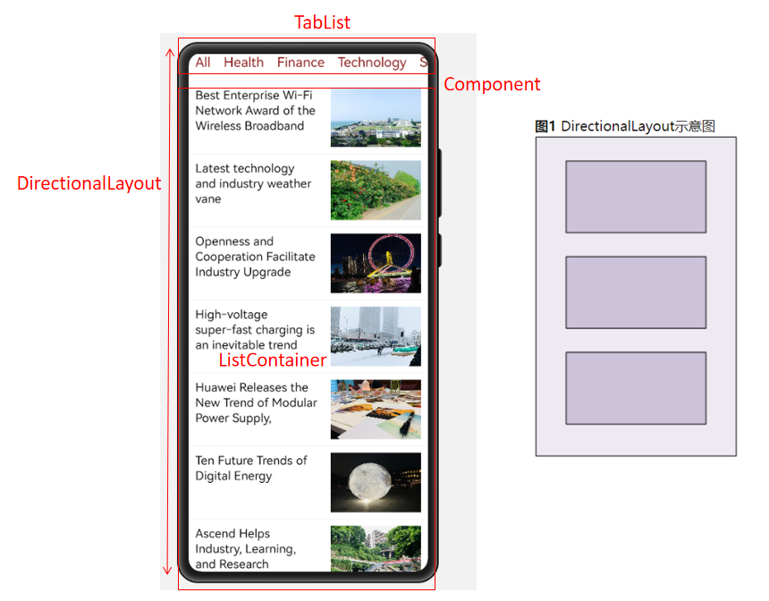
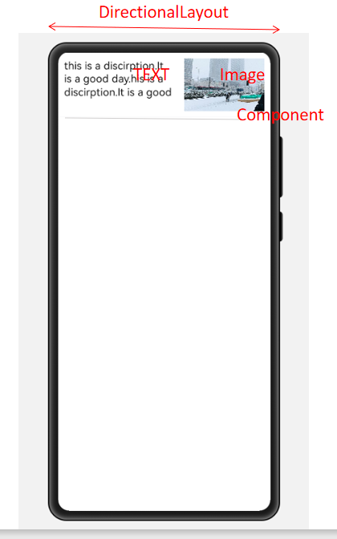
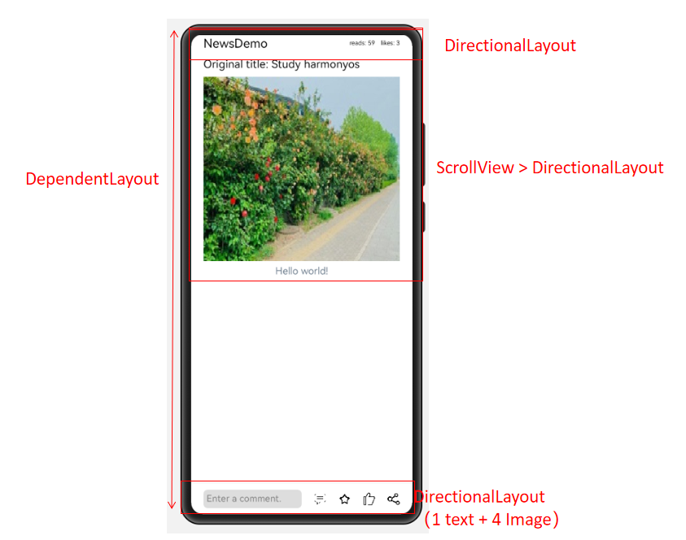
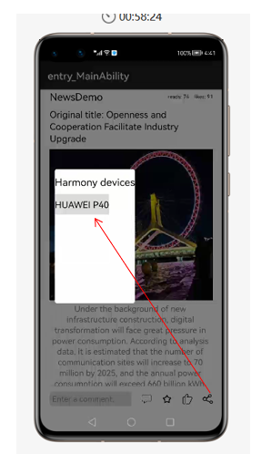

# 创建HarmonyOS工程

1.创建新的HarmonyOS工程，并启动模拟器。


# 导入必要的资源

1.新闻图片资源

2.导入util类：CommonUtils，LogUtils

3.拷贝初始新闻数据json，在build.gradle引入Gson包

```
implementation 'com.google.code.gson:gson:2.8.6'
```

4.创建model包，和实体对象NewsInfo，NewsType
NewsType

```java
public class NewsType {
    private String name;
}
```
创建实体对象NewsInfo
```java
public class NewsInfo {
    private String title;

    private String type;

    private String imgUrl;

    private String reads;

    private String likes;

    private String content;
}
```

# 开发新闻列表页面



1.开发新闻列表主页面ability_main.xml

```xml
<?xml version="1.0" encoding="utf-8"?>
<DirectionalLayout
    xmlns:ohos="http://schemas.huawei.com/res/ohos"
    ohos:width="match_parent"
    ohos:height="match_parent"
    ohos:orientation="vertical">

    <TabList
        ohos:id="$+id:tab_category_list"
        ohos:tab_margin="10vp"
        ohos:text_size="20fp"
        ohos:height="40vp"
        ohos:width="match_parent"
        ohos:normal_text_color="#FF881515"
        ohos:selected_text_color="#FFEC0B0B"
        ohos:selected_tab_indicator_color="#FF1F0606"
        ohos:selected_tab_indicator_height="2vp"
        >
    </TabList>

    <Component
        ohos:width="match_parent"
        ohos:height="0.5vp"
        ohos:background_element="#EAEAEC"
        />

    <ListContainer
        ohos:id="$+id:news_container"
        ohos:width="match_parent"
        ohos:height="match_parent"/>
</DirectionalLayout>

```

2.单个新闻列表项item_news_layout.xml



```xml
<?xml version="1.0" encoding="utf-8"?>
<DirectionalLayout
    xmlns:ohos="http://schemas.huawei.com/res/ohos"
    ohos:height="110vp"
    ohos:width="match_parent"
    ohos:orientation="vertical">

    <DirectionalLayout
        ohos:height="109.5vp"
        ohos:width="match_parent"
        ohos:orientation="horizontal"
        ohos:padding="10vp">

        <Text
            ohos:id="$+id:item_news_title"
            ohos:height="match_content"
            ohos:width="0vp"
            ohos:max_text_lines="3"
            ohos:multiple_lines="true"
            ohos:right_padding="20vp"
            ohos:text_size="18vp"
            ohos:weight="3"
            ohos:text="this is a discirption.It is a good day.this is a discirption.It is a good day."
            />

        <Image
            ohos:id="$+id:item_news_image"
            ohos:height="match_parent"
            ohos:width="0vp"
            ohos:scale_mode="stretch"
            ohos:weight="2"
            ohos:image_src="$media:news_image4"/>

    </DirectionalLayout>

    <Component
        ohos:height="0.5vp"
        ohos:width="match_parent"
        ohos:background_element="#EAEAEC"
        />
</DirectionalLayout>
```

3.添加NewsListProvider,它是连接页面listcontainer和newsInfoList新闻数据的桥梁.

```java
public class NewsListProvider extends BaseItemProvider {
    private List<NewsInfo> newsInfoList;
    private Context context;

    /**
     * constructor function
     *
     * @param newsInfoList list info
     * @param context context
     * @since 2020-12-04
     */
    public NewsListProvider(List<NewsInfo> newsInfoList, Context context) {
        this.newsInfoList = newsInfoList;
        this.context = context;
    }

    @Override
    public int getCount() {
        return newsInfoList == null ? 0 : newsInfoList.size();
    }

    @Override
    public Object getItem(int i) {
        return newsInfoList.get(i);
    }

    @Override
    public long getItemId(int i) {
        return i;
    }

    @Override
    public Component getComponent(int position, Component component, ComponentContainer componentContainer) {
        ViewHolder viewHolder;
        Component temp = component;
        if (temp == null) {
            temp = LayoutScatter.getInstance(context).parse(ResourceTable.Layout_item_news_layout, null, false);
            viewHolder = new ViewHolder();
            viewHolder.title = (Text) temp.findComponentById(ResourceTable.Id_item_news_title);
            viewHolder.image = (Image) temp.findComponentById(ResourceTable.Id_item_news_image);
            temp.setTag(viewHolder);
        } else {
            viewHolder = (ViewHolder) temp.getTag();
        }
        viewHolder.title.setText(newsInfoList.get(position).getTitle());
        viewHolder.image.setPixelMap(CommonUtils.getPixelMapFromPath(context, newsInfoList.get(position).getImgUrl()));
        return temp;
    }

    /**
     * ViewHolder which has title and image
     *
     * @since 2020-12-04
     */
    private static class ViewHolder {
        Text title;
        Image image;
    }
}
```

4.实现MainAbilitySlice.java从json里获取和显示新闻


```java
    private TabList categoryTabList;
    private ListContainer newsListContainer;

    private List<NewsInfo> totalNewsDataList;
    private List<NewsInfo> newsDataList;

    private NewsListProvider newsListProvider;


    @Override
    public void onStart(Intent intent) {
        super.onStart(intent);
        super.setUIContent(ResourceTable.Layout_ability_main);
        initView();
        initData();
    }
    
        private void initData() {
        Gson gson = new Gson();
        List<NewsType> newsTypeList =
                gson.fromJson(
                        CommonUtils.getStringFromJsonPath(this, "entry/resources/rawfile/news_type_datas.json"),
                        new TypeToken<List<NewsType>>() {
                        }.getType());
        totalNewsDataList =
                gson.fromJson(
                        CommonUtils.getStringFromJsonPath(this, "entry/resources/rawfile/news_datas.json"),
                        new TypeToken<List<NewsInfo>>() {
                        }.getType());

        newsDataList = new ArrayList<>();
        newsDataList.addAll(totalNewsDataList);

        newsListProvider = new NewsListProvider(newsDataList, this);
        newsListContainer.setItemProvider(newsListProvider);

        for (NewsType type : newsTypeList) {
            TabList.Tab tab = categoryTabList.new Tab(this);
            tab.setText(type.getName());
            categoryTabList.addTab(tab);
        }
       
    }
    
        private void initView() {
        categoryTabList = (TabList) this.findComponentById(ResourceTable.Id_tab_category_list);
        newsListContainer = (ListContainer) this.findComponentById(ResourceTable.Id_news_container);
    }
```

# 新闻列表页面类型切换
MainAbilitySlice.java
```java
    private void initListener() {

        categoryTabList.addTabSelectedListener(new TabList.TabSelectedListener() {
            @Override
            public void onSelected(TabList.Tab tab) {
                newsDataList.clear();
                for (NewsInfo mTotalNewsData : totalNewsDataList) {
                    if (tab.getText().equals(mTotalNewsData.getType()) || tab.getPosition() == 0) {
                        newsDataList.add(mTotalNewsData);
                    }
                }
                updateListView();
            }

            @Override
            public void onUnselected(TabList.Tab tab) {

            }

            @Override
            public void onReselected(TabList.Tab tab) {

            }
        });
    }

    private void updateListView() {
        newsListProvider.notifyDataChanged();
        newsListContainer.invalidate();
        newsListContainer.scrollToCenter(0);
    }
```

# 点击某个新闻进入新闻详情
1.新增NewsDetailAbilitySlice.java

```java
public class NewsDetailAbilitySlice extends AbilitySlice {
    public static final String INTENT_TITLE = "intent_title";
    public static final String INTENT_READ = "intent_read";
    public static final String INTENT_LIKE = "intent_like";
    public static final String INTENT_CONTENT = "intent_content";
    public static final String INTENT_IMAGE = "intent_image";
    
    @Override
    protected void onStart(Intent intent) {
        super.onStart(intent);
        super.setUIContent(ResourceTable.Layout_news_detail_layout);
    }
}
```

2.修改新闻详情的页面布局news_detail_layout.xml

```xml
<?xml version="1.0" encoding="utf-8"?>
<DependentLayout
    xmlns:ohos="http://schemas.huawei.com/res/ohos"
    ohos:id="$+id:parent_layout"
    ohos:width="match_parent"
    ohos:height="match_parent">

   <Text
       ohos:height="match_parent"
       ohos:width="match_parent"
       ohos:text="news detail"
       ohos:text_size="50vp"/>
</DependentLayout>
```

3.修改MainAbility增加router路由

```java
 addActionRoute("action.detail", NewsDetailAbilitySlice.class.getName());
```

4.修改config.json的路由配置，action增加"action.detail"

5.newsListContainer.setItemClickedListener 设置按钮响应

```java
        newsListContainer.setItemClickedListener(
                (
                        ListContainer listContainer, Component
                        component,
                        int position, long l) ->

                {
                    Intent intent = new Intent();
                    Operation operation =
                            new Intent.OperationBuilder()
                                    .withBundleName(getBundleName())
                                    .withAbilityName(MainAbility.class.getName())
                                    .withAction("action.detail")
                                    .build();
                    intent.setOperation(operation);
                    intent.setParam(NewsDetailAbilitySlice.INTENT_TITLE, newsDataList.get(position).getTitle());
                    intent.setParam(NewsDetailAbilitySlice.INTENT_READ, newsDataList.get(position).getReads());
                    intent.setParam(NewsDetailAbilitySlice.INTENT_LIKE, newsDataList.get(position).getLikes());
                    intent.setParam(NewsDetailAbilitySlice.INTENT_CONTENT, newsDataList.get(position).getContent());
                    intent.setParam(NewsDetailAbilitySlice.INTENT_IMAGE, newsDataList.get(position).getImgUrl());
                    startAbility(intent);
                }
        );
```


# 新闻详细列表页面



1.修改news_detail_layout.xml

```xml
<?xml version="1.0" encoding="utf-8"?>
<DependentLayout
    xmlns:ohos="http://schemas.huawei.com/res/ohos"
    ohos:id="$+id:parent_layout"
    ohos:width="match_parent"
    ohos:height="match_parent">

    <ScrollView
        ohos:width="match_parent"
        ohos:height="match_parent">

        <DirectionalLayout
            ohos:width="match_parent"
            ohos:height="match_content"
            ohos:bottom_padding="70vp"
            ohos:left_margin="20vp"
            ohos:right_margin="20vp"
            ohos:orientation="vertical">

            <DirectionalLayout
                ohos:width="match_parent"
                ohos:height="match_content"
                ohos:alignment="vertical_center"
                ohos:orientation="horizontal">

                <Text
                    ohos:id="$+id:title_icon"
                    ohos:width="match_content"
                    ohos:height="match_content"
                    ohos:weight="1"
                    ohos:text="NewsDemo"
                    ohos:text_size="20fp"/>

                <Text
                    ohos:id="$+id:read_num"
                    ohos:width="match_content"
                    ohos:height="match_content"
                    ohos:text_size="10fp"
                    ohos:right_margin="10vp"/>

                <Text
                    ohos:id="$+id:like_num"
                    ohos:width="match_content"
                    ohos:height="match_content"
                    ohos:text_size="10fp"/>
            </DirectionalLayout>

            <Text
                ohos:id="$+id:title_text"
                ohos:width="match_parent"
                ohos:height="match_content"
                ohos:text_size="18fp"
                ohos:max_text_lines="4"
                ohos:multiple_lines="true"
                ohos:text_color="#000000"
                ohos:top_margin="10vp"/>

            <Image
                ohos:id="$+id:image_content"
                ohos:width="match_parent"
                ohos:scale_mode="stretch"
                ohos:height="300vp"
                ohos:top_margin="10vp"/>

            <Text
                ohos:id="$+id:title_content"
                ohos:width="match_parent"
                ohos:height="match_content"
                ohos:multiple_lines="true"
                ohos:text_color="#708090"
                ohos:text_size="16vp"
                ohos:text_alignment="horizontal_center"
                ohos:top_margin="5vp"/>

        </DirectionalLayout>

    </ScrollView>

    <Component
        ohos:above="$+id:bottom_layout"
        ohos:width="match_parent"
        ohos:height="0.5vp"
        ohos:background_element="#EAEAEC"
        />

    <DirectionalLayout
        ohos:id="$+id:bottom_layout"
        ohos:align_parent_bottom="true"
        ohos:width="match_parent"
        ohos:height="50vp"
        ohos:orientation="horizontal"
        ohos:background_element="#ffffff"
        ohos:alignment="vertical_center"
        ohos:left_padding="20vp"
        ohos:right_padding="20vp"
        >

        <TextField
            ohos:id="$+id:text_file"
            ohos:width="160vp"
            ohos:height="30vp"
            ohos:left_padding="5vp"
            ohos:right_padding="10vp"
            ohos:text_alignment="vertical_center"
            ohos:text_size="15vp"
            ohos:hint="Enter a comment."
            ohos:background_element="$graphic:corner_bg_comment"/>

        <Image
            ohos:id="$+id:button1"
            ohos:width="20vp"
            ohos:height="20vp"
            ohos:image_src="$media:message_icon"
            ohos:scale_mode="stretch"
            ohos:left_margin="20vp"/>

        <Image
            ohos:id="$+id:button2"
            ohos:width="20vp"
            ohos:height="20vp"
            ohos:image_src="$media:collect_icon"
            ohos:scale_mode="stretch"
            ohos:left_margin="20vp"/>

        <Image
            ohos:id="$+id:button3"
            ohos:width="20vp"
            ohos:height="20vp"
            ohos:image_src="$media:like_icon"
            ohos:scale_mode="stretch"
            ohos:left_margin="20vp"/>

        <Image
            ohos:id="$+id:button4"
            ohos:width="20vp"
            ohos:height="20vp"
            ohos:image_src="$media:share_icon"
            ohos:scale_mode="stretch"
            ohos:left_margin="20vp"/>
    </DirectionalLayout>
</DependentLayout>
```
2.新增TextField背景corner_bg_comment.xml

```xml
<?xml version="1.0" encoding="utf-8"?>
<shape xmlns:ohos="http://www.w3.org/2001/XMLSchema-instance"
       ohos:shape="rectangle">
    <corners
        ohos:radius="20"/>
    <solid
        ohos:color="#22000000"/>
</shape>
```

3.修改NewsDetailAbilitySlice.java

```java
public class NewsDetailAbilitySlice extends AbilitySlice {
    public static final String INTENT_TITLE = "intent_title";
    public static final String INTENT_READ = "intent_read";
    public static final String INTENT_LIKE = "intent_like";
    public static final String INTENT_CONTENT = "intent_content";
    public static final String INTENT_IMAGE = "intent_image";

    private DependentLayout parentLayout;
    private TextField commentFocus;
    private Image iconShared;
    private NewsInfo curNewsInfo;

    private List<DeviceInfo> devices = new ArrayList<>();

    private CommonDialog dialog;
    private static final int DIALOG_SIZE_WIDTH = 900;
    private static final int DIALOG_SIZE_HEIGHT = 800;
    private static final int WAIT_TIME = 30000;


    @Override
    protected void onStart(Intent intent) {
        super.onStart(intent);
        super.setUIContent(ResourceTable.Layout_news_detail_layout);
        curNewsInfo = getCurNewsInfo(intent);
        initView();
    }

    private NewsInfo getCurNewsInfo(Intent intent) {
        curNewsInfo = new NewsInfo();
        curNewsInfo.setLikes(intent.getStringParam(INTENT_LIKE));
        curNewsInfo.setReads(intent.getStringParam(INTENT_READ));
        curNewsInfo.setContent(intent.getStringParam(INTENT_CONTENT));
        curNewsInfo.setTitle(intent.getStringParam(INTENT_TITLE));
        curNewsInfo.setImgUrl(intent.getStringParam(INTENT_IMAGE));
        return curNewsInfo;
    }

    public void initView() {
        parentLayout = (DependentLayout) findComponentById(ResourceTable.Id_parent_layout);
        commentFocus = (TextField) findComponentById(ResourceTable.Id_text_file);
        iconShared = (Image) findComponentById(ResourceTable.Id_button4);
        Text newsRead = (Text) findComponentById(ResourceTable.Id_read_num);
        Text newsLike = (Text) findComponentById(ResourceTable.Id_like_num);
        Text newsTitle = (Text) findComponentById(ResourceTable.Id_title_text);
        Text newsContent = (Text) findComponentById(ResourceTable.Id_title_content);
        Image newsImage = (Image) findComponentById(ResourceTable.Id_image_content);
        newsRead.setText("reads: " + curNewsInfo.getReads());
        newsLike.setText("likes: " + curNewsInfo.getLikes());
        newsTitle.setText("Original title: " + curNewsInfo.getTitle());
        newsContent.setText(curNewsInfo.getContent());
        newsImage.setPixelMap(CommonUtils.getPixelMapFromPath(this, curNewsInfo.getImgUrl()));
    }
}
```


# 识别设备，显示设备列表




1. config.json添加权限

   ```json
       "reqPermissions": [
         {
           "name": "ohos.permission.DISTRIBUTED_DATASYNC"
         },
         {
           "name": "ohos.permission.GET_DISTRIBUTED_DEVICE_INFO"
         }
       ]
   ```
   2.添加device_list_item.xml

   ```xml
   <?xml version="1.0" encoding="utf-8"?>
   <DirectionalLayout
       xmlns:ohos="http://schemas.huawei.com/res/ohos"
       ohos:id="$+id:id_front"
       ohos:height="55vp"
       ohos:width="match_parent"
       ohos:background_element="#ffffff"
       ohos:orientation="vertical">
   
       <Text
           ohos:id="$+id:item_chlid_textview"
           ohos:height="40vp"
           ohos:width="match_parent"
           ohos:background_element="#DCDCDC"
           ohos:text_size="18vp"/>
   
       <Component
           ohos:height="0.5fp"
           ohos:width="match_parent"
           ohos:background_element="#EAEAEC"
           />
   </DirectionalLayout>
   ```
   
3. 添加DevicesListProvider.java 

   ```java
   public class DevicesListProvider extends BaseItemProvider {
       private List<DeviceInfo> deviceInfoList;
       private Context context;
   
       /**
        * constructor function
        *
        * @param listBasicInfo list info
        * @param context context
        * @since 2020-12-04
        */
       public DevicesListProvider(List<DeviceInfo> listBasicInfo, Context context) {
           this.deviceInfoList = listBasicInfo;
           this.context = context;
       }
   
       @Override
       public int getCount() {
           return deviceInfoList == null ? 0 : deviceInfoList.size();
       }
   
       @Override
       public Object getItem(int i) {
           return deviceInfoList.get(i);
       }
   
       @Override
       public long getItemId(int i) {
           return i;
       }
   
       @Override
       public Component getComponent(int position, Component component, ComponentContainer componentContainer) {
           ViewHolder viewHolder;
           Component temp = component;
           if (temp == null) {
               temp = LayoutScatter.getInstance(context).parse(ResourceTable.Layout_device_list_item, null, false);
               viewHolder = new ViewHolder();
               viewHolder.devicesName = (Text) temp.findComponentById(ResourceTable.Id_item_chlid_textview);
               temp.setTag(viewHolder);
           } else {
               viewHolder = (ViewHolder) temp.getTag();
           }
           viewHolder.devicesName.setText(deviceInfoList.get(position).getDeviceName());
           return temp;
       }
   
       /**
        * ViewHolder which has devicesName
        *
        * @since 2020-12-04
        */
       private static class ViewHolder {
           private Text devicesName;
       }
   }
   ```
3. NewsDetailAbilitySlice增加监听事件
```java
    public void initListener() {

        iconShared.setClickedListener(
                v -> {
                    initDevices();
                    showDeviceList();
                });
    }
```


   4.NewsDetailAbilitySlice.java增加点击按钮跳转事件,弹窗显示设备列表

   ```java
     private void initDevices() {
           if (devices.size() > 0) {
               devices.clear();
           }
           List<DeviceInfo> deviceInfos =
                   DeviceManager.getDeviceList(DeviceInfo.FLAG_GET_ONLINE_DEVICE);
           devices.addAll(deviceInfos);
       }
   
       private void showDeviceList() {
           dialog = new CommonDialog(NewsDetailAbilitySlice.this);
           dialog.setAutoClosable(true);
           dialog.setTitleText("Harmony devices");
           dialog.setSize(DIALOG_SIZE_WIDTH, DIALOG_SIZE_HEIGHT);
           ListContainer devicesListContainer = new ListContainer(getContext());
           DevicesListProvider devicesListProvider = new DevicesListProvider(devices, this);
           devicesListContainer.setItemProvider(devicesListProvider);
           devicesListContainer.setItemClickedListener(
                   (listContainer, component, position, id) -> {
                       dialog.destroy();
                       //startAbilityFA(devices.get(position).getDeviceId());
                   });
           devicesListProvider.notifyDataChanged();
           dialog.setContentCustomComponent(devicesListContainer);
           dialog.show();
       }
   ```

5.使用分布式模拟器调测效果


# 跨设备拉起FA,传递新闻数据

1.NewsDetailAbilitySlice增加拉起FA代码

```java
    private void startAbilityFA(String devicesId) {
        Intent intent = new Intent();
        Operation operation =
                new Intent.OperationBuilder()
                        .withDeviceId(devicesId)
                        .withBundleName(getBundleName())
                        .withAbilityName(MainAbility.class.getName())
                        .withFlags(Intent.FLAG_ABILITYSLICE_MULTI_DEVICE)
                        .withAction("action.detail")
                        .build();
        intent.setOperation(operation);
        intent.setParam(NewsDetailAbilitySlice.INTENT_TITLE, curNewsInfo.getTitle());
        intent.setParam(NewsDetailAbilitySlice.INTENT_READ, curNewsInfo.getReads());
        intent.setParam(NewsDetailAbilitySlice.INTENT_LIKE, curNewsInfo.getLikes());
        intent.setParam(NewsDetailAbilitySlice.INTENT_CONTENT, curNewsInfo.getContent());
        intent.setParam(NewsDetailAbilitySlice.INTENT_IMAGE, curNewsInfo.getImgUrl());
        startAbility(intent);
   }
```

2.MainAbility里动态申请权限,提示用户

```
requestPermissionsFromUser(new String[]{"ohos.permission.DISTRIBUTED_DATASYNC"}, 0);

```

