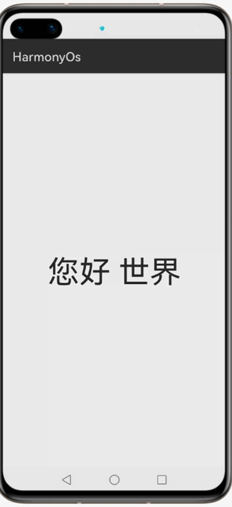
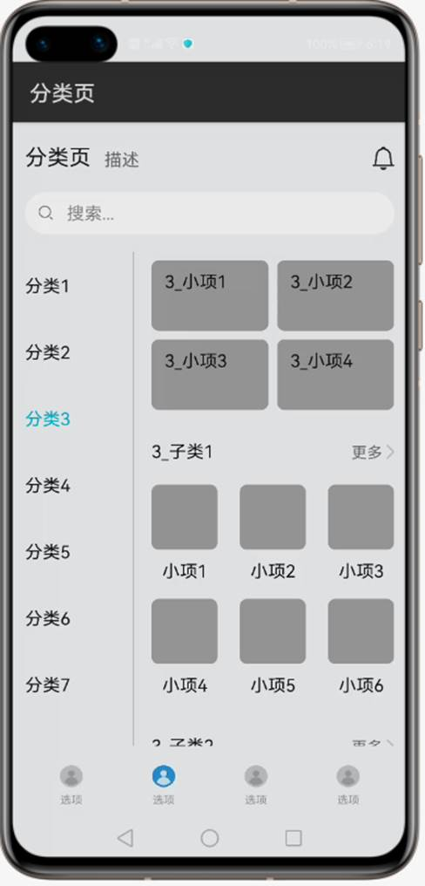
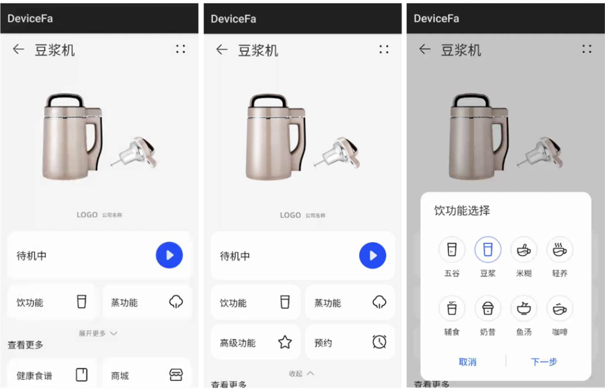
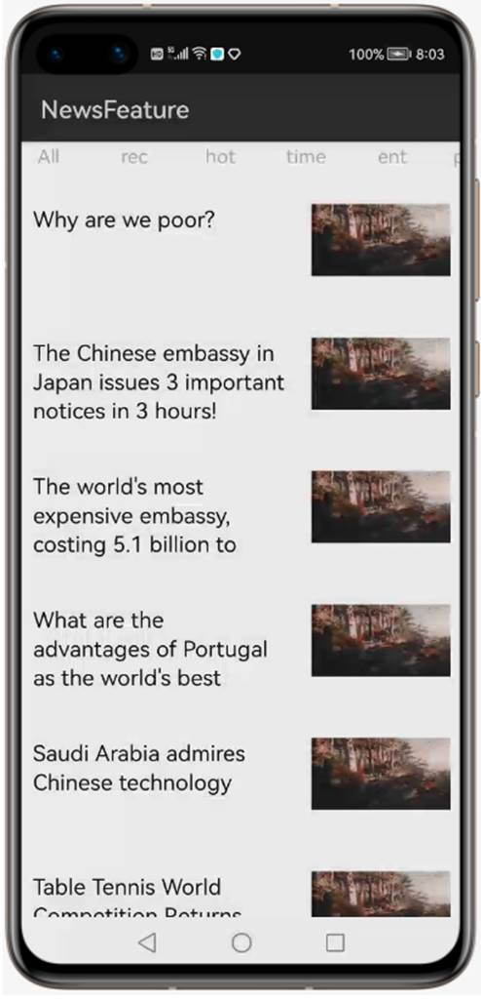

# 5个工程，迅速上手HamonyOS应用开发

最近，总有兄弟问我HamonyOS应用该怎么开发，应该从哪块入手学习。我强憋一口气，严肃而认真地说道，你倒是亲自下载DevEco Studio试一下啊。其实DevEco Studio里面已经内置了20+个工程模板，从经典的Hello World，到常用布局和UI控件使用，再到体现分布式的设备发现和设备迁移应有尽有。基于这些模板工程，我们已足够信心修改成自己想要的HamonyOS应用。

不过在这里，我还是给大家福利下，经过我长达1天的学习，隆重推出我认为当前最经典的HamonyOS应用TOP 5工程模板。只要弄懂了它们，基本上已经打通了任督二脉。

# 模板1：Empty Feature Ability(Java/Js)
### 模板截图

###  模板解读
经典的HelloWorld工程，JAVA应用使用XML布局，居中显示“Hello World”。JS应用使用hml布局，居中显示文本内容Hello World或您好，世界，显示语言与系统语言一致。通过该工程可以对HamonyOS应用的目录结构，配置文件以及模拟器的使用，有个较全面的认知。

# 模板2：Category Page Feature Ability(Java) 
### 模板截图

###  模板解读
包含了当前XML布局的最常用的三种方式DependentLayout，DirectionalLayout，TableLayout，也包含如何使用java代码动态创建布局。

# 模板3：Navigation Feature Ability(Java)
### 模板截图

###  模板解读
包含代码自定义AppBar顶部标题栏，使用include引入其他资源xml。
使用PageSlider切换页面。
使用ListContainer动态关联数据及自定义列表界面。

# 模板4：Device Control Feature Ability(JS)
### 模板截图

###  模板解读
包含代码使用JS语言开发，支持由开发者编写json配置文件来生成对应的设备控制界面，并调用JAVA FA。

# 模板5：News Feature Ability(Java)
### 模板截图

###  模板解读
包含代码如何发现设备，迁移设备的代码。实现了新闻可以跨设备分享的场景。通过该工程，我们可以实际体验设备发现和设备流转的API应该如何使用。

# 结束语
以上工程，均可以在[DevEco Studio](https://developer.harmonyos.com/cn/develop/deveco-studio#download)创建工程时选择模板后创建和运行。待你消化完这些模板工程后，是不是有信心可以开搞了？ 如果你还想进阶学习，可以参考[Codelab](https://developer.huawei.com/consumer/cn/codelabsPortal/index)，以及使用[官方组件库](https://hpm.harmonyos.com/hapm)。祝你早日上架HarmonyOs应用~~